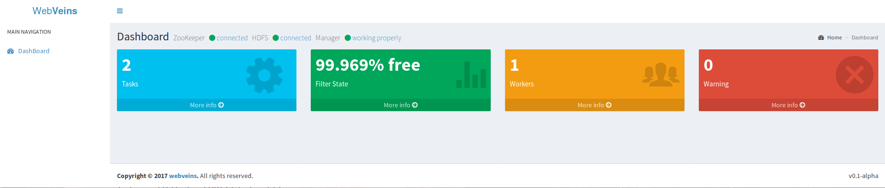

# WebVeins

[](https://gitter.im/WebVeins/Lobby?utm_source=badge&utm_medium=badge&utm_campaign=pr-badge&utm_content=badge)
[](https://travis-ci.org/xiongbeer/WebVeins)
[](https://raw.githubusercontent.com/xiongbeer/WebVeins/master/LICENSE)
[](https://xiongbeer.gitbooks.io/webveinsguide/content/)
## 分布式爬虫调度器

### 简介
WebVeins是一个将单机爬虫快速整合为分布式爬虫的框架，它并不关心爬虫具体的业务逻辑，与爬虫是松耦合的  
大概在10月份会推出第一版release

### WhyWebVeins
分布式爬虫已经有许多非常成熟的框架了，比如基于MapReduce的超大型分布式爬虫、基于Redis这样的内存数据库的主从分布式爬虫、也有基于一致性Hash这样的对等分布式爬虫  

各个爬虫框架各有所长也有所短，不存在谁比谁一定优秀的问题，只是在某些需求下会更有优势，WebVeins也是如此  
WebVeins的原理与上面都不相同，但是也有相通的地方，比如说它也是主从的（但是后面它也会支持联邦Master），它很多设计思想都来源于MapReduce与HDFS，它也会依赖HDFS与ZooKeeper的某些特性来对超大型集群来做优化，站在巨人的肩膀上能让它走得更远。  

另外，大多数的框架都是一个完整的实现：爬虫、分布式调度、日志管理与监控系统等等。但是请注意，WebVeins基本上不会提供任何与爬虫有关的服务（后期可能会提供一些与数据库交互的可选的API接口）。  
它专注于如何建立起一个稳定的然后再是尽量提升效率的分布式调度服务。说它是分布式调度系统，它也没有那么全面，它只是针对爬虫而生的，所以在使用之前您需要明白：

1. WebVeins与爬虫的松耦合性让它能与绝大多数的爬虫协同工作
2. WebVeins不提供爬虫的功能，它的核心业务是为爬虫分发任务、维持系统稳定和集群的监控与管理
3. WebVeins设计的重点是稳定性，即强大的灾难重建功能，和横向扩展能力（基于廉价的商用机器），然后才是效率性
4. WebVeins的部署与使用简单，但是由于它依赖于HDFS与ZooKeeper，如果您不了解的话，在它出现错误时可能难以解决，性能调优同样的也十分困难，不过在文档中会帮助您去了解一些这方面的知识，也会介绍WebVeins各个部分的设计原理

希望这能帮助您了解与选择要不要使用WebVeins.
### Manual
更新中...   
[文档](https://xiongbeer.gitbooks.io/webveinsguide/content/)

### Shell
提供了获取运行信息的脚本，源码中也提供了对应的API  

    Usage:
        webveins COMMAND [OPTIONS]

    COMMAND:
        -v                                  print the version
        -h                                  this help message
        -l [workers|tasks|filters]          list the status
        -r [manager|worker]                 run service
        -s [manager|worker]                 stop service
        -c [manager|worker]                 check if the local service is running    

### 网页管理 preview
基于  [tomcat](https://github.com/apache/tomcat) 和 [AdminLTE](https://github.com/almasaeed2010/AdminLTE) 实现了一个简易的网页可视化监控的demo，现在只有最基础的功能，在后续的版本随着API的完善会成为一个完善的集群监控和控制系统  



提前试用
[WebVeins-visualization
](https://github.com/xiongbeer/WebVeins-visualization)

### TODOLIST
* [ ] 完整的监控与控制API
* [ ] 支持多个active manager，能在任务分类的情况下进行工作
* [ ] 支持多个filter，新增部分filter类型
* [ ] 异步调用支持
* [ ] python API支持
* [ ] Go API支持
* [ ] 加强负载均衡与性能优化


### 依赖
- ZooKeeper >= 3.4.9
- Hadoop >= 2.7.3
- jdk 1.8
- linux内核系统

### 安装
1. clone本项目
```
$ git clone https://github.com/xiongbeer/WebVeins.git
```

2. 将clone的根目录添加到环境变量
```
# cat WEBVEINS_HOME=*YOUR_CLONE_DIR* >> /etc/profile
```

3. 配置$WEBVEINS_HOME/conf下的core.xml文件，里面有详细的注释

4. 启动zookeeper服务与hdfs文件系统，启动$WEBVEINS_HOME/bin下的wvformat脚本，初始化zookeeper和hdfs的目录树
```
$ $WEBVEINS_HOME/bin/wvformat -n
```

5. 启动manager服务「如果有多个，第一台机器启动的manager为active状态，后续启动的为standby状态」
```
$ $WEBVEINS_HOME/bin/webveins -r manager
```

6. 启动worker服务「爬虫节点需要启动，需要shell功能也需要开启此服务」
```
$ $WEBVEINS_HOME/bin/webveins -r worker
```

### Quick Start

爬虫实现 *com.xiongbeer.webveins.service.local.Action* 这个接口

```
public class Crawler implements Action{
        /* 在爬取过程中需要把新的Url保存下来，结束后上传 */
        private static Set<String> newUrls = new new ConcurrentSet<String>();
        /*
            返回true代表任务成功，false则为放弃该任务
            每当Server端成功领取到任务就会执行run方法
        */
        @Override
        public boolean run(String urlFilePath) {
            try {
                /* 读取任务Urls */
                List<String> urlsList = new UrlFileLoader().readFileByLine(urlFilePath);

                /*
                 *    do something
                 */

                /* 上传新的urls */
                Bootstrap.upLoadNewUrls(newUrls);
                return true;
            } catch (IOException e) {
                e.printStackTrace();
                System.exit(1);
            }
            return false;
        }

        ...

        public static void main(String[] args){
            Crawler crawler = new Crawler();
            /* 将爬虫实例传给引导类 */
            Bootstrap bootstrap = new CrawlerBootstrap(crawler);
            /* 初始化，连接到本地Worker服务端 */
            bootstrap.init();
            /* 准备好啦，可以开始工作了 */
            bootstrap.ready();
            /* 任务执行完毕后记得关闭连接 */
            bootstrap.close();
        }
    }
```

具体的实例可以参考源代码中example包下的结合webmagic的例子
